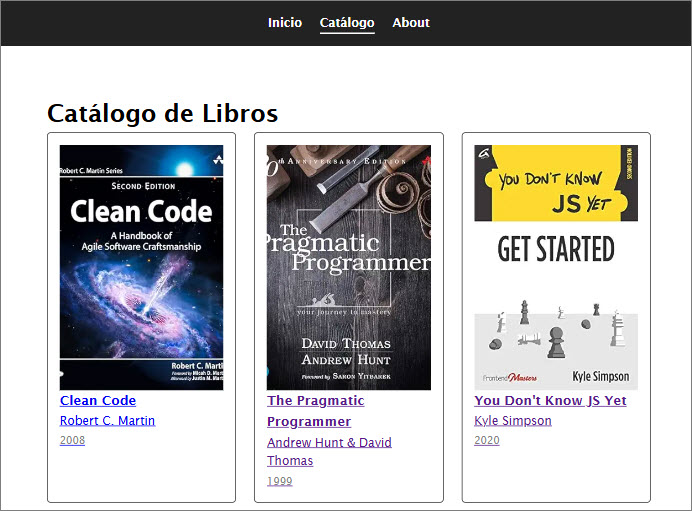

# ejercicio5
ejercicio 5 / Modulo VI - Vue

ejercicio desplegado: https://ramirezjm.github.io/ejercicio5/

[](https://choosealicense.com/licenses/mit/)


Mini SPA con vue-router, contiene rutas estáticas y ruta dinámica con :id, navegación con `<router-link>` y visualización con `<router-view>`, paso de parámetros como props (props: true), redirección y alias.

## View Home

```Vue
 {
    path: '/',
    name: 'home',
    component: Home
  }
```
<div>
  
</div>

Además contiene redirección, si alguien entra a `/inicio` termina en `/`

```Vue
 {
    path: '/inicio',
    redirect: '/'
  }
```

## Catálogo
Se creó una vista para el catálogo de productos. La view Catalog.vue importa un json con datos de productos, hace v-for, pasa como prop cada producto a un componente Tarjeta.vue, que renderiza y contiene el `<router-link`

Catalog.vue
```HTML
  <section class="catalog">
    <h1>Catálogo de Libros</h1>
    <div class="grid">
      <Tarjeta v-for="book in books" :key="book.id" :book="book" />
    </div>
  </section>
```

Tarjeta.vue
```HTML
 <div class="card">
    <router-link :to="`/product/${book.id}`">
      
      <h2>{{ book.title }}</h2>
      <p>{{ book.author }}</p>
      <small>{{ book.year }}</small>
    </router-link>
  </div>
```

<div>
  
</div>

## Ruta dinámica
Se tiene navegación a cada producto usando un ruta dinámica. La view Product.vue recibe un id como prop, importa el json de datos, busca el producto correspondiente, muestra el detalle y maneja el caso que no exista. 

```Vue
 {
    path: '/product/:id',
    name: 'product',
    component: Product,
    props: true
  }
```

Product.vue

```HTML
<section class="product">
    <div v-if="book">
      
      <h1>{{ book.title }}</h1>
      <p><strong>Autor:</strong> {{ book.author }}</p>
      <p><strong>Año:</strong> {{ book.year }}</p>
      <p class="description">{{ book.description }}</p>
    </div>
    <!-- si se agrega un id no existente se muestra
     el mensaje de respaldo -->
    <div v-else>
      <h2>Libro no encontrado</h2>
      <router-link to="/catalog">
        Volver al catálogo
      </router-link>
    </div>
  </section>
```

<div>
  
</div>

## Alias
Se agrega un alias, para que tanto `/about` como `/acerca` muestren la view About.view

```Vue
{
    path: '/about',
    name: 'about',
    component: About,
    alias: '/acerca'
  }
```
<div>
  
  
</div>


### Clonar el repositorio

  ```bash
   git clone https://github.com/RamirezJM/ejercicio5.git
   cd ejercicio5
  ```

### Instalar dependencias

```bash
npm install
```

### Levantar el servidor

```bash
npm run dev
```
